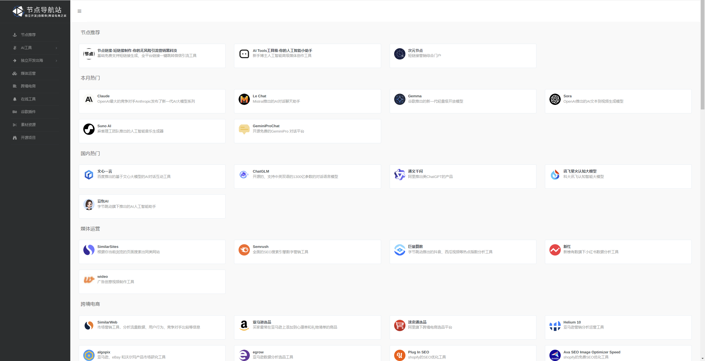
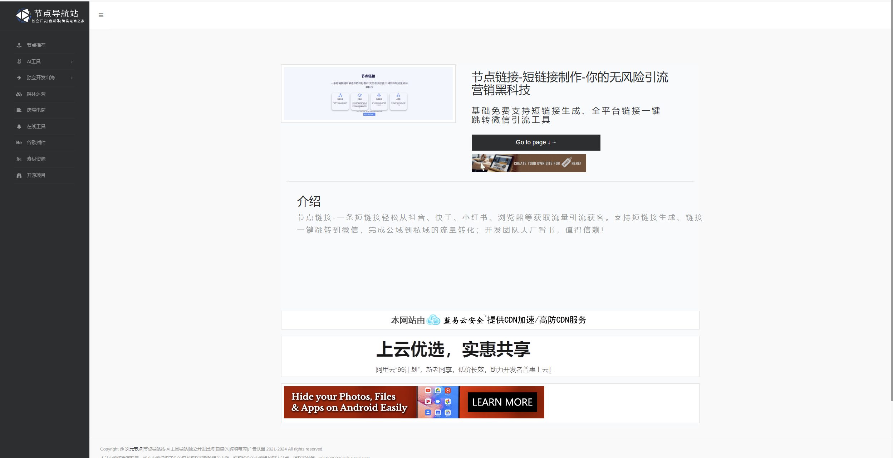
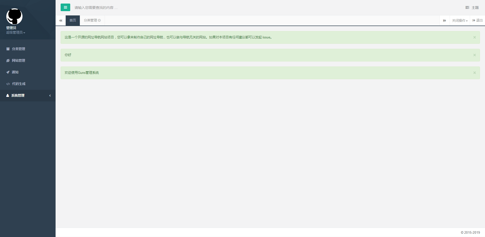
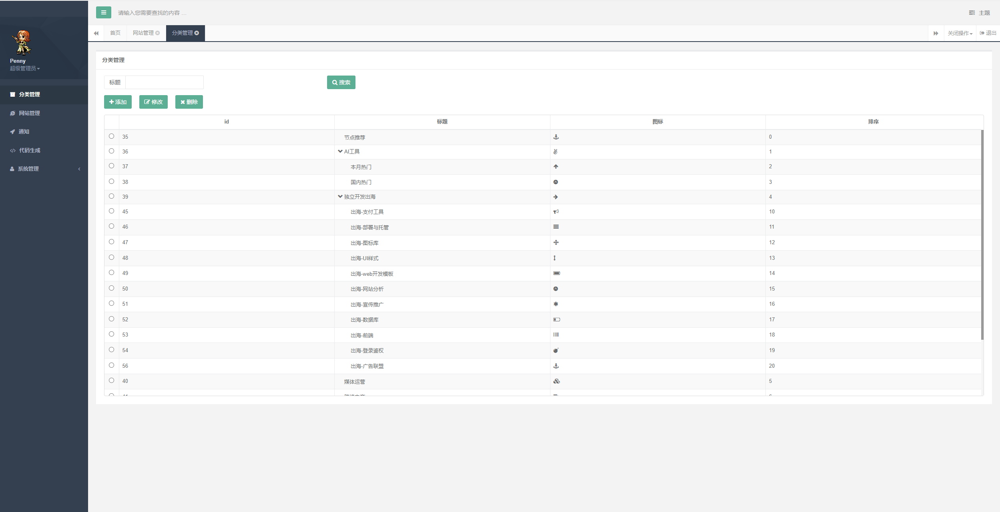
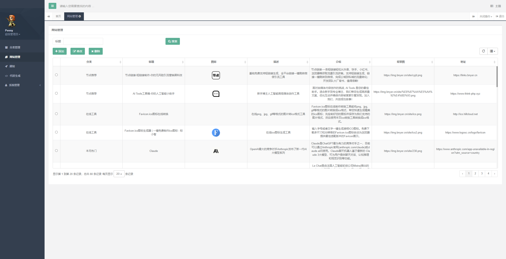

# linktre.cc
linktre.cc节点导航站的开源版本。一个基于WebStack-Guns的二次开发加工的开源的网址导航网站项目，具备完整的前后台，可以拿来制作自己的网址导航。喜欢的话欢迎踊跃✨✨STAR✨✨<br/>
【[开源仓库工具大全linktre-tools](https://github.com/PennyJoly/linktre-tools)】<br/>
在原有项目基础上进行了如下优化完善：<br/>
1、新增了站点详情页功能；<br/>
2、更好的支持SEO优化；<br/>
3、支持模块化控制文案描述、广告加载；<br/>
4、支持每月免费10G容量的[**七牛云**](https://s.qiniu.com/faYbqa) 文件存储；<br/>




## 运行

克隆代码：

```shell
https://github.com/PennyJoly/linktre.cc.git
```

导入IDE，建议用IDEA打开项目目录，待maven下载完jar包


编辑配置：

```
resources目录下的 application.yml、application-dev.yml、application-prod.yml
```
```
该项目使用每月免费10G容量的七牛云作为存储系统，启动项目前请修改成你对应的路径地址。
上传文件：
内部图片文件路径都在linktre.cc/src/main/webapp/static/img/下
```

```
...
数据库采用mysql连接，用户名密码：
url: jdbc:mysql://你的mysql地址/guns?useUnicode=true&characterEncoding=utf8&zeroDateTimeBehavior=convertToNull&useSSL=true&serverTimezone=GMT%2B8
username: mysql账号
password: mysql密码
...
```

新建数据库guns(utf8mb4)，导入数据：

```shell
guns.sql
```

maven打包或者IDE启动服务：

```shell
运行linktre.cc/run/start.sh 执行服务启动部署
可自行修改脚本内容中的端口号以及脚本存放位置，如：/home/service/site/ 以及运行参数。(默认以dev研发环境启动)
```

启动完成：http://localhost:8090


## 使用

后台地址：

本地后台： http://你的域名/admin

默认用户：admin

默认密码：111111

在线演示效果: https://linktre.cc








## SEO优化注意事项
```shell
文件夹下linktre.cc/src/main/webapp/WEB-INF.view/siteDetails/里的页面均根据数据site表的主键id作为页面名称。新添加页面时请注意保持数据主键id和该页面名称同步。
```

## 感谢

前端设计：[**WebStackPage**](https://github.com/WebStackPage/WebStackPage.github.io)

后台框架：[**Guns**](https://github.com/stylefeng/Guns)

开源框架：[**WebStack-Guns**](https://github.com/jsnjfz/WebStack-Guns)

&nbsp;&nbsp;&nbsp;&nbsp;&nbsp;&nbsp;&nbsp;&nbsp;&nbsp;&nbsp;&nbsp;&nbsp;&nbsp;&nbsp;&nbsp;&nbsp;&nbsp;&nbsp;**SpringBoot**

## 作者简介

各位老板你们好，近期咱们这边上新一款产品，不知道你们平常工作生活中，会不会用到chatgpt4.0，我们即将上新一个openai服务中转站，为了回馈各位老板，该产品价格力求做到全网最低，
最大能达到0.01人民币兑换100美元token的量，支持openai旗下所有产品。群每增加20人，我发放一个gpt4.0的token出来，感兴趣的老板可以扫描二维码进群了解详情


这里是Kevin，一个🧰大厂裸辞上瘾的独立开发者。<br/>
✨连续创业多次building in public。 <br/>
🙈全平台获客工具[**『节点链接』**](https://links.bnyer.cn) 已上线。 <br/>
🔥[**『节点导航站』-AI工具|独立开发出海|自媒体|跨境电商|广告联盟』**](https://linktre.cc) 🌈现已上线 <br/>
✨ [**twitter(x)：Kevin不会写代码**](https://x.com/pennyjoly/status/1783305526119662061?s=46)  <br/>
✨ [**小红书：Kevin不会写代码**](https://www.xiaohongshu.com/user/profile/600d92e3000000000100bbde?xhsshare=CopyLink&appuid=600d92e3000000000100bbde&apptime=1714458726)  <br/>
✨ [**微信公众号：次元节点**](https://mp.weixin.qq.com/mp/profile_ext?action=home&__biz=Mzg2NjkwNzk5Mw==&scene=124#wechat_redirect)  <br/>
🎉不定时分享好用免费🆓工具及创业心得~ <br/>

## buy me coffee~


## License

MIT
